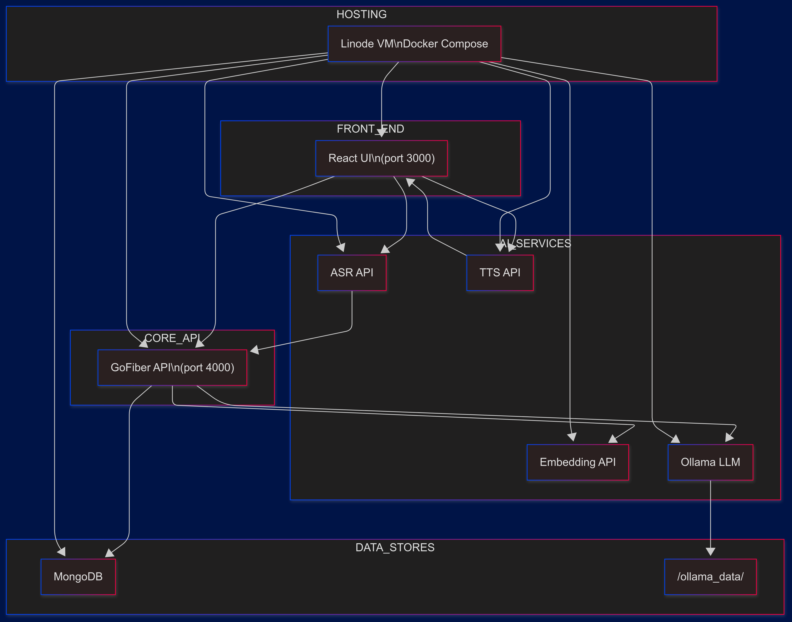
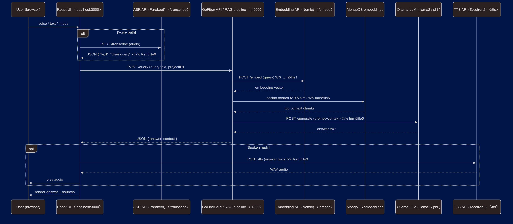

# Flamekeeper – Architecture & Data‑Flow

## 1  System Architecture

### Pods / Containers

| Pod name                     | Port    | Tech stack            | Core responsibility                                    |
| ---------------------------- | ------- | --------------------- | ------------------------------------------------------ |
| **React UI**                 | `3000`  | Vite + React          | Collect text, voice, image; render answers; play audio |
| **GoFiber API**              | `4000`  | Go + Fiber            | Orchestrate the RAG pipeline and CRUD operations       |
| **ASR API**                  | `8001`  | FastAPI + Parakeet    | Speech‑to‑text transcription                           |
| **Embedding API**            | `8000`  | FastAPI + nomic‑embed | Text → vector embeddings                               |
| **Ollama LLM**               | `11434` | llama.cpp server      | GPT‑class text generation                              |
| **TTS API**                  | `5000`  | Flask + Tacotron2     | Text‑to‑speech WAV synthesis                           |
| **Caption API** *(optional)* | `8010`  | BLIP mini             | Image → caption                                        |
| **MongoDB**                  | `27017` | Mongo 7               | Store embedded chunks & project configs                |
| **Volume**                   | —       | Docker volume         | Persist Ollama model weights                           |

All containers run on a single host (local or Linode VM) under `docker‑compose`, sharing an internal bridge network.  
Only ports **80/443** (for the UI) are exposed publicly; service ports stay private.

---

## 2  End‑to‑End Data‑Flow

1. **User** speaks, types, or uploads an image from the browser.
2. **React UI**
   - sends audio → **ASR API** → gets transcript text, or
   - sends image → **Caption API** → gets a single‑sentence caption.  
     Both transcript/caption are concatenated with any typed text.
3. UI POSTs `/query` to **GoFiber API** with the final prompt.
4. GoFiber calls **Embedding API** → receives an embedding vector.
5. Vector search against **MongoDB** returns the top‑N context chunks.
6. GoFiber assembles `system + context + user` prompt and forwards it to **Ollama LLM**.
7. LLM responds with an answer.
8. GoFiber returns `{answer, context}` JSON to the UI.
9. UI optionally POSTs answer text to **TTS API** → receives a WAV.
10. **React UI** displays the text answer, citations, and (if requested) plays the audio back to the user.

That closed loop delivers a multimodal, RAG‑grounded recommendation in roughly 2–3 seconds on an 8 GB VM.
