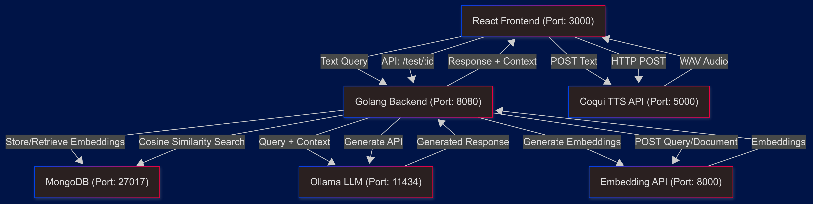

# 🔥 Flamekeeper

Flamekeeper is a free, open-source AI system designed for local-first, offline intelligence. It provides a modular pipeline for processing text queries, retrieving relevant information, generating responses, and converting them to audio, all running on your machine after downloading dependencies. The system is built with six pods, each handling a specific function, communicating over local ports in development mode.

## Architecture Diagram

## 🛠️ Pods and Functionality

Flamekeeper consists of the following pods, each running on a dedicated port:

1. **React Frontend (Port: 3000)**  
   A React-based web interface for user interaction. It:

   - Accepts text queries from users.
   - Displays AI-generated responses and raw JSON outputs.
   - Triggers audio playback of responses.
     Built with JavaScript and React, it runs at `localhost:3000` and communicates with the Golang Backend and Coqui TTS API.

2. **Golang Backend (Port: 8080)**  
   The core server, built with the Fiber framework, manages the query pipeline. It:

   - Receives queries from the frontend.
   - Requests embeddings from the Embedding API.
   - Performs semantic search using MongoDB.
   - Sends queries to the Ollama LLM for response generation.
   - Returns responses to the frontend.
     Written in Go, it runs at `localhost:8080`.

3. **MongoDB (Port: 27017)**  
   A database for persistent storage. It:

   - Stores document embeddings and metadata.
   - Supports semantic search via cosine similarity.
     Using MongoDB 7.0, it runs at `localhost:27017` with a persistent volume for data.

4. **Ollama LLM (Port: 11434)**  
   A local language model server (e.g., `qwen3:1.7b`) for generating responses. It:

   - Processes queries and document context from the Golang Backend.
   - Produces text responses.
     Built with Ollama, it runs at `localhost:11434` with a volume for model persistence.

5. **Coqui TTS API (Port: 5000)**  
   A text-to-speech service for audio output. It:

   - Converts text responses to WAV audio.
   - Serves audio files to the frontend.
     Built with Python, Flask, and Tacotron2, it runs at `localhost:5000`.

6. **Embedding API (Port: 8000)**  
   A service for generating semantic embeddings. It:
   - Converts queries and documents into embeddings (e.g., using Sentence-BERT).
   - Supports the Golang Backend’s semantic search.
     Built with Python and FastAPI, it runs at `localhost:8000`.

## 🌐 How It Works

The pods interact to process queries and deliver responses:

- The React Frontend (`localhost:3000`) sends user queries to the Golang Backend (`localhost:8080`) via an API (e.g., `/test/:id`).
- The Backend requests embeddings from the Embedding API (`localhost:8000`) for queries and documents.
- The Backend searches MongoDB (`localhost:27017`) for relevant document chunks using cosine similarity.
- Queries and context are sent to the Ollama LLM (`localhost:11434`) for response generation.
- The Backend returns responses to the Frontend.
- The Frontend sends text to the Coqui TTS API (`localhost:5000`) for audio conversion, receiving WAV files for playback.

This modular design ensures each pod can be developed and tested independently, while the system operates offline for privacy and efficiency.

## 📝 Codebase

The codebase is organized by pod:

- **React Frontend**: JavaScript/React code in a frontend directory, serving the UI at `localhost:3000`.
- **Golang Backend**: Go/Fiber code handling the core pipeline, running at `localhost:8080`.
- **MongoDB**: Configured via Docker Compose, with data stored in a volume.
- **Ollama LLM**: Custom Docker image with model-pulling logic, running at `localhost:11434`.
- **Coqui TTS API**: Python/Flask code with Tacotron2, running at `localhost:5000`.
- **Embedding API**: Python/FastAPI code for embeddings, running at `localhost:8000`.
